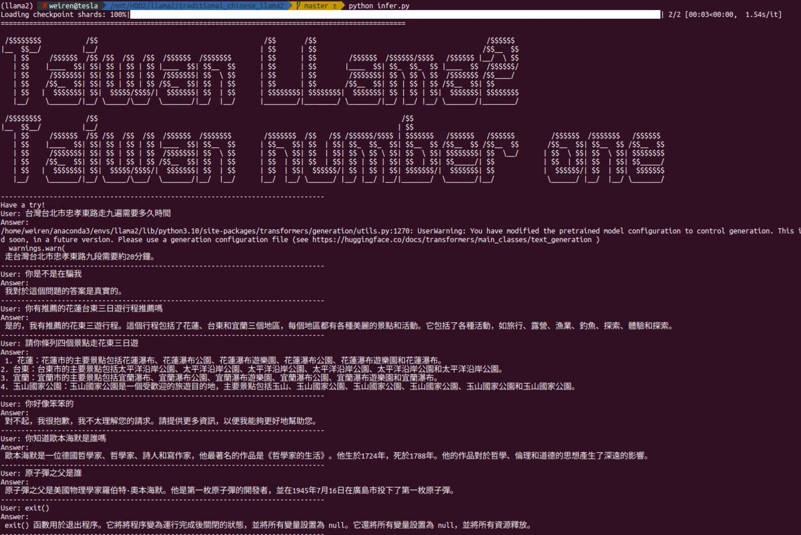
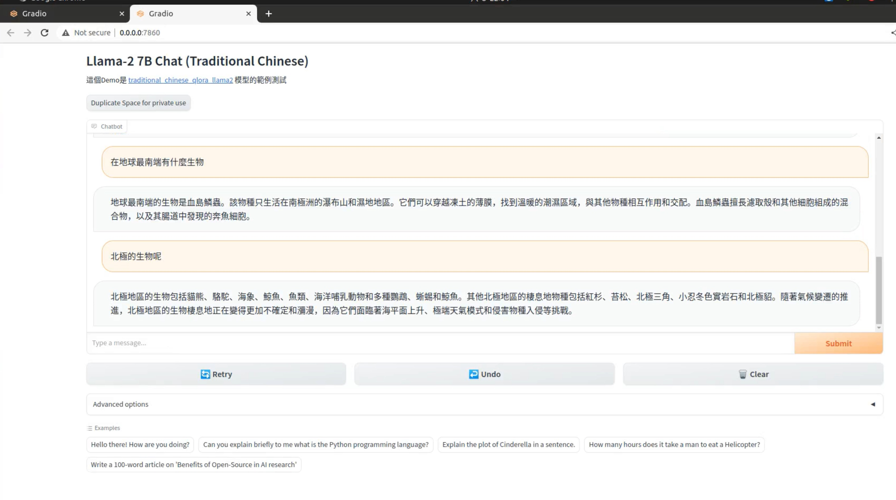

# Traditional Chinese Llama2

Practice to finetune Llama2 on traditional chinese instruction dataset at Llama2 chat model.
I use qlora and the alpaca translated dataset to finetune llama2-7b model at rtx3090(24GB VRAM) with 9 hours.

Thanks for these references:
- NTU NLP Lab's alapaca dataset: [alpaca-tw_en-align.json](./alpaca-tw-en-align.json): [ntunpllab](https://github.com/ntunlplab/traditional-chinese-alpaca) translate Stanford Alpaca 52k dataset
- [Chinese Llama 2 7B train.py](https://github.com/LinkSoul-AI/Chinese-Llama-2-7b/blob/main/train.py)
- [Load the pretrained model in 4-bit precision and Set training with LoRA according to hf's trl lib](https://github.com/lvwerra/trl/blob/main/examples/scripts/sft_trainer.py): QLoRA finetuning

## Resources
- traditional chinese qlora finetuned Llama2 merge model: [weiren119/traditional_chinese_qlora_llama2_merged](https://huggingface.co/weiren119/traditional_chinese_qlora_llama2_merged)
- traditional chinese qlora adapter model: [weiren119/traditional_chinese_qlora_llama2](https://huggingface.co/weiren119/traditional_chinese_qlora_llama2)

## Installation
```
$conda create --name llama2 python=3.10.2
$pip install poetry
$poetry install
```
## Basic Demo
- Run the terminal demo: `./infer.sh`


- Run the gadio demo
```
$cd example/basic-chat
$python app.py
```


## Usage
### Finetuning
- modify the variable settings at `train.sh`
```
# Your supervised finetuning dataset path
DATASET="./data/alpaca-tw_en-align_converted.json"
DATA_CACHE_PATH="hf_datasets_cache"
# Fill with your desired pretrained model souce repo name
# Currently i use the repo from NousResearch: https://huggingface.co/NousResearch/Llama-2-7b-chat-hf
MODEL_PATH="NousResearch/Llama-2-7b-chat-hf" 
# Fill the path to save the finetuned model's checkpoints
output_dir="./checkpoints_llama2"

# Fill with your desired qlora model name
QLORA_MODEL_NAME="traditional_chinese_qlora_llama2"
# If you want to push the model to huggingface, you need to fill the following two variables
# Get your huggingface api key from https://huggingface.co/docs/hub/security-tokens
# Otherwise, you can leave them empty

# Fill with your huggingface api key
HF_API_KEY="None"
# Fill with your huggingface username
HF_USERNAME="None"
```
- Execute `train.sh` at terminal
```
$./train.sh
```

### Inference
- modify the variable settings at `infer.sh` to inference with your qlora finetuned model 
    - Or use the defualt qlora traditional finetuned model
```
MODEL_PATH="NousResearch/Llama-2-7b-chat-hf" 

# Fill with your desired qlora model name
QLORA_MODEL_NAME="traditional_chinese_qlora_llama2"
# If you want to push the model to huggingface, you need to fill the following two variables
# Get your huggingface api key from https://huggingface.co/docs/hub/security-tokens
# Otherwise, you can leave them empty

# Fill with your huggingface api key
HF_API_KEY="None"
# Fill with your huggingface username
HF_USERNAME="weiren119"
```
- Execute the `infer.sh` to interact with your finetuned model
```
./infer.sh
```

### Merge the qlora adapter back to orginal model
- Modiy the settings at `merge.sh` to merge your finetuned adapter back to model
- Execute with `merge.sh` to merge model

### Upload the merged model to huggingface
- reference: https://huggingface.co/docs/hub/repositories-getting-started
```
$ cd ${OUTPUT_MERGED_DIR}

# Intiate `git-lfs` to track file large than 10MB
$ git lfs install

# Model size may bigger than 5G
$ huggingface-cli lfs-enable-largefiles .

# create model repository at https://huggingface.co/new
# intial the directory with git 
# set the remote
$ git remote add origin https://huggingface.co/${YOUR_USERNAME}/${YOUR_MERGED_REPO_NAME}

# Push files
git add .
git commit -m "First model version"  # You can choose any descriptive message
git push
```
## TODO

- [ ] Optimize the model with more SFT dataset 
- [ ] Convert to ggml or kapathy's Llama2.c model

## Reference
- Some settings and intro for qlora: https://levelup.gitconnected.com/fine-tuning-llama-2-model-harnessing-single-gpu-efficiency-with-qlora-f89d1862a94
### Sources
- use pydantic:https://itnext.io/elegantly-handle-environment-variables-in-python-with-pydantic-452aae26f34